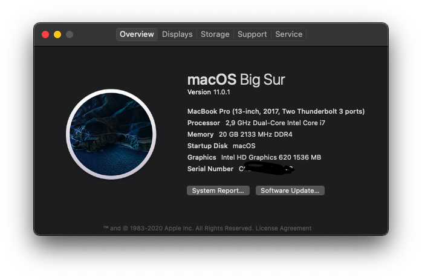

#  Thinkpad T470s 
## Opencore Hackintosh

### Hardware Config: 

- Model: Lenovo Thinkpad T470s
- Chipset: Intel Core i7-7600u
- Graphics: Intel HD 620
- Monitor: 1080p with Multi-touch 
- Storage: NVMe 256GB SSD
- RAM: 20 GB 2133 MHz DDR4
- 1 x PS/2 Trackpad + Trackpoint 
- 1 x PS/2 Keyboard
- 1 x USB 3.0 card reader
- 3 x USB 3.0 type a ports
- 1 x TB3/USB C port
- 1 x HDMI port
- 1 x 3.5mm mic/headphone jack
- 1 x smart card reader
- 1 x WWAN network sim

### Working
- All USB port
- CPU Power Management
- Graphic Intel HD 620
- Thunderbolt 3 (with HDMI)
- Touchpad - Gestures
- Battery Treshold
- Trackpoint
- Wifi
- Ethernet
- Camera
- Restart, Sleep, Shutdown
- Brightness (Screen & Backlit Keyboard)
- Internal speaker, headphone

### Not Working 
- Touchscreen
- Bluetooth
- HDMI

### Untested
- SD Card reader
